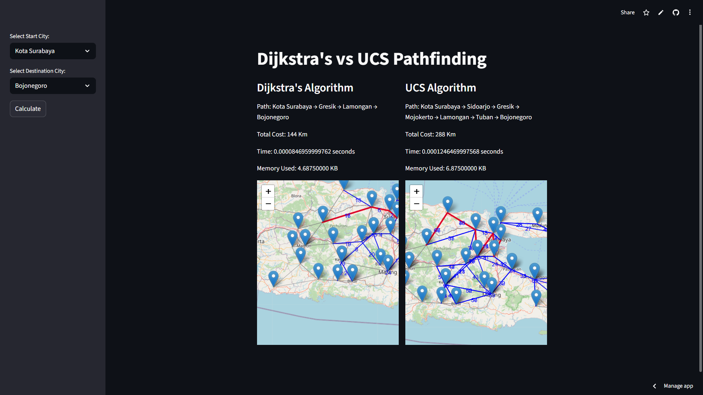

# East Java Route Finder (Streamlit)

This repository reorganizes the original project into a professional, modular structure **without changing the original logic**. 
All algorithms and UI behavior are preserved; we've only split the code into multiple files for clarity.

## Preview UI


## How to run

```bash
pip install -r requirements.txt
streamlit run app/streamlit_app.py
```

## Notes
- The dataset file **east-java-cities-dataset.xlsx** stays at the repository root and the loader uses the exact same preprocessing as your original code.
- Algorithms (**Dijkstra** and **UCS**) were moved into `route_finder/algorithms/algorithms.py` with their bodies kept verbatim.
- The Streamlit UI logic was moved into `route_finder/ui.py` and is called by `app/streamlit_app.py`.

## Project layout
```
app/
  streamlit_app.py
route_finder/
  __init__.py
  data_loader.py
  graph_io.py
  utils.py
  ui.py
  algorithms/
    __init__.py
    algorithms.py
east-java-cities-dataset.xlsx
requirements.txt
README.md
```

License: MIT
